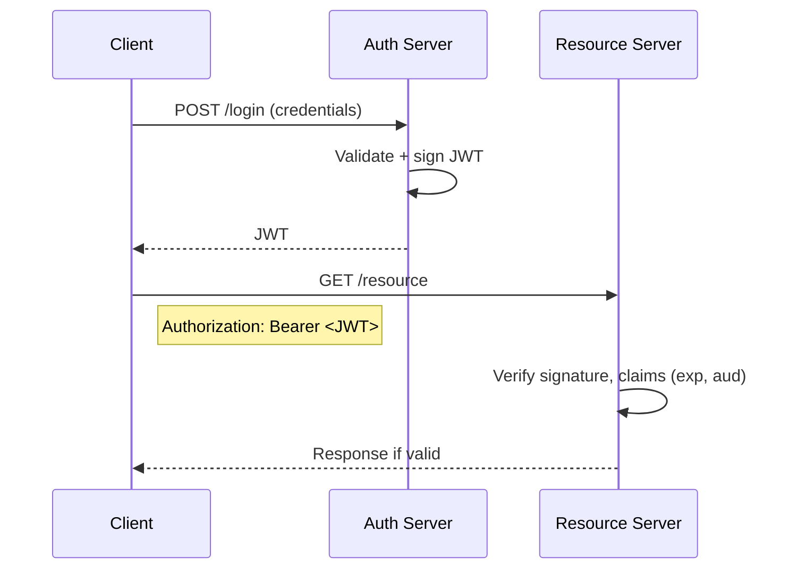
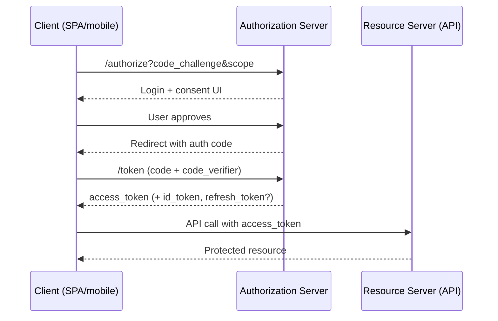
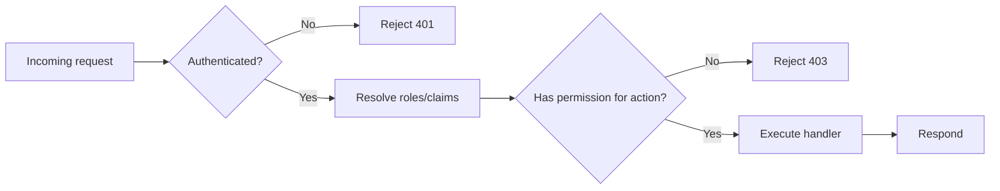

# 5. Authentication and Authorization

Authentication answers "Who are you?" while authorization answers "What can you do?". Both must work together to protect data and capabilities.

## Overview
- Authentication was once implied through trust and vouching. This is not scalable, so explicit proof emerged.
- Two pillars: *who you are* (authentication) and *what you can do* (authorization).

## Authentication: from seals to modern protocols
- Early proofs: wax seals, signet rings → "something you possess".
- Telegraph era: pass-phrases/passwords → "something you know".
- Hashing: store irreversible, fixed-length representations of passwords.
- Asymmetric crypto: Diffie–Hellman key exchange enables a shared secret over untrusted media; PKI operationalizes public/private keys.
- Limits of username/password: brute force, reuse, phishing → rise of MFA (know/have/are).
- Modern frameworks: OAuth 2.0, JWT, zero-trust postures, passwordless (WebAuthn/FIDO2), hardware-bound keys, and future post-quantum + behavioral signals.

## Sessions, cookies, and JWTs
### Stateful sessions (cookie + server store)
1) Client submits credentials; server validates.
2) Server creates a session ID and stores user context in a fast store (e.g., Redis) with TTL.
3) Session ID is sent as an HttpOnly cookie; the browser sends it on every request.
4) Server looks up the session ID to authorize; can revoke centrally.

Session flow (stateful):

```mermaid
sequenceDiagram
  participant C as Client
  participant S as Server
  participant R as Session Store
  C->>S: POST /login (credentials)
  S->>S: Validate user
  S->>R: Create session {id, user, ttl}
  R-->>S: Session saved
  S-->>C: Set-Cookie: sid=<id>; HttpOnly
  C->>S: Subsequent request + Cookie(sid)
  S->>R: Lookup sid
  R-->>S: Session data
  S-->>C: Authorized response
```

Notes:
- Early sessions were file-based on a single server (bad for scale), then moved to databases, then to in-memory caches (Redis/memcached) for distribution and speed.
- Revocation and rotation are simple because the server owns the session record.

### Stateless tokens (JWT)
- Self-contained token: header (alg, typ), payload (claims like `sub`, `role`, `iat`), signature (HMAC/RS/EC) over base64url-encoded header+payload.
- Sent in `Authorization: Bearer <JWT>`; server validates signature and claims without session lookup.
- Pros: no server session storage, works across regions/servers.
- Cons: theft enables impersonation until expiry; server cannot revoke a single token without extra state.
- Hybrid approach: keep JWTs but also track allow/deny lists (e.g., Redis blacklist) to kill compromised tokens.
- Example layout: [JWT sample](og_notes/images/5-jwtexample.png).

Request flow (stateless JWT):



### Cookies in auth flows
- Server sets a cookie (often HttpOnly, SameSite, Secure) that carries a session ID or token.
- Browser sends it automatically on same-site requests; reduces XSS exposure if HttpOnly.

## Choosing stateful vs stateless
**Stateful**
- Pros: centralized control, easy revocation/lockout, straightforward auditing; good default for most SaaS.
- Cons: needs shared store + coordination across regions; extra infra dependency.

**Stateless**
- Pros: easy horizontal scaling, no session store dependency; great for distributed APIs/mobile.
- Cons: revocation/rotation harder; keep TTLs short, rotate keys, and consider denylists.

## API key authentication
- One-sided secret for machine-to-machine access; caller identity is the key itself.
- Enables usage tracking/quotas and is easy to generate/rotate.
- Lacks user identity and fine-grained scopes unless you add metadata/scoping in your system.

## OAuth 2.0 and OpenID Connect (OIDC)
- Delegation so one app can access another app's resources without password sharing.
- Actors: resource owner (user), client (app), authorization server (issues tokens), resource server (protects APIs).
- Common flows:
  - Authorization Code (with PKCE for public clients): standard for web/mobile.
  - Client Credentials: machine-to-machine, no end user.
  - Device Code: devices with limited input (TVs, consoles).
- Tokens: access token authorizes API calls; refresh token extends life; ID token (OIDC) is a JWT describing the authenticated user for "Sign in with X".

Authorization Code + PKCE (browser/native app):



## Authorization (what you can do)
- Role-Based Access Control (RBAC): roles (admin, moderator, user) map to permissions.
- Typical path: user authenticates → server resolves role (token claims or DB) → enforcement checks role/permission on each action.
- Apply least privilege; keep checks close to the resource.

RBAC enforcement sketch:



## Extra but important
### Error messages
- Specific errors leak signals ("user not found", "incorrect password"). Keep responses generic (e.g., "Invalid credentials").

### Timing attacks
- Naive flows return faster when a user is missing than when password comparison runs, leaking existence.
- Mitigations: constant-time comparisons for secrets; add uniform response delays; avoid branching that changes timing based on account presence.

### Password storage refresher
- Never store plaintext. Store salted hashes (bcrypt/scrypt/Argon2). On login, hash the supplied password and compare hashes.
